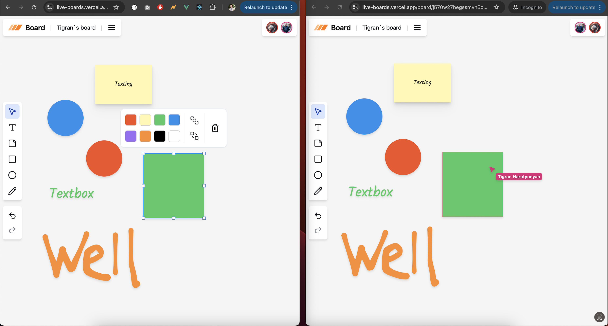
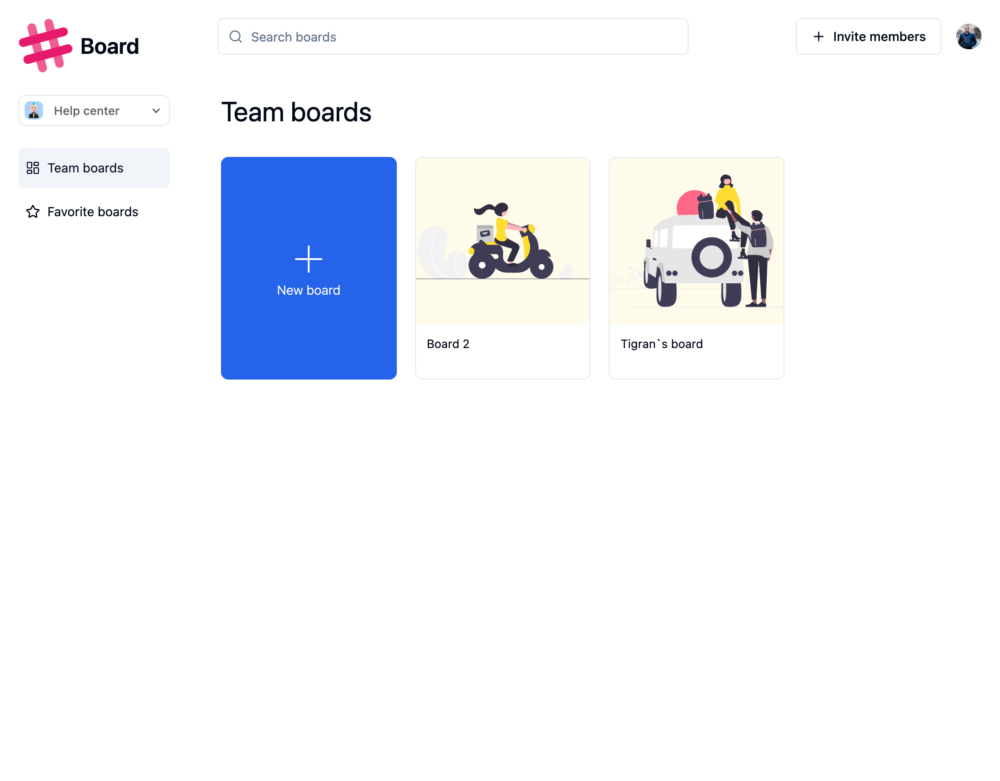

# Collaboration tool with wide range of features. Vue.js, Tailwind, Shadcn, Convex, Liveblocks, Canvas

[Live app](https://live-boards.vercel.app/)

[Video](https://shorturl.at/0wVUE)

Features:

- Tailwind CSS Design: Utilizes a modern and customizable utility-first CSS framework for streamlined and aesthetic UI.
- Fully Responsive: Ensures seamless functionality and design across all devices and screen sizes.
- ShadCN Component Library: Leverages pre-built, accessible, and highly customizable UI components for faster development.
- Convex for Data Operations: Handles complex data manipulation and real-time display with robust backend capabilities.
- Authentication: Implements Clerk for user authentication.
- Liveblocks: Implementation of collaborative experiences.
- Organizations: Includes the ability to create, edit, delete, and invite members to organizations.
- Board Management: Includes the ability to create, edit, delete, and invite members to workspaces.
- Creation of canvas shapes, notes and texts on : Features for creating, editing, and deleting, reorganizing shapes on a board.
- Real-Time Communication: Provides instant, lag-free updates across all connected clients via Convex and Liveblocks.
- Reactive Data Management: Automates data updates without requiring manual code refetching, improving development efficiency.

